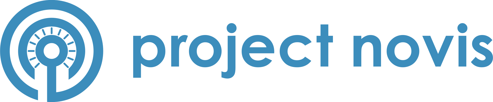

<h1 align=center>

</h1>

We want to establish a open platform for ham radio related web services everyone can participate.

# Features

- OAuth Provider
- Amateur Radio Database
   - Callsign
   - Callsign prefix
   - DMR ID
   - Repeater
- Callsign/User validation
- API
- Hamnet Authentication via RADIUS server

# Contribute

- Issue Tracker: https://github.com/elnappo/project-novis/issues
- Source Code: https://github.com/elnappo/project-novis

# Support

If you are having issues, please let us know.
Send a mail to: support@project-novis.org

# License

project-novis is licensed under the [AGPL-3.0](https://www.gnu.org/licenses/agpl-3.0.en.html) license.
